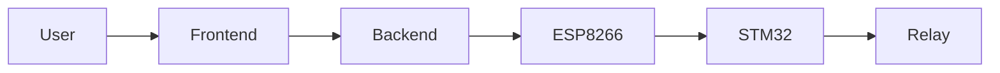

# Backend API

## 1. Overview

The Backend API provides communication between the Frontend Dashboard, ESP8266 gateway modules, and the backend server. Sensor data is acquired by STM32 controllers and transmitted through ESP8266 gateways.

## 2. Authentication API

### POST /api/login

User authentication.

#### Request

```json
{
  "username": "admin",
  "password": "123456"
}
```

#### Response

```json
{
  "status": "success",
  "token": "jwt_token"
}
```

## 3. Latest Sensor Data API

### GET /api/sensor/latest

Returns the most recent sensor data.

#### Response

```json
{
  "temperature": 28.5,
  "humidity": 70.2,
  "light": 450,
  "timestamp": "2026-08-05 10:30:00"
}
```

## 4. Sensor History API

### GET /api/sensor/history

Returns historical sensor records.

#### Response

```json
[
  {
    "temperature": 28.5,
    "humidity": 70.2,
    "light": 450,
    "timestamp": "2026-08-05 10:30:00"
  }
]
```
## 5. Dashboard API

### GET /api/dashboard

Returns summarized information for the dashboard view.

#### Response

```json
{
  "temperature": 28.5,
  "humidity": 70.2,
  "light": 450,

  "fan_status": true,
  "light_status": false,
  "buzzer_status": false,

  "alert_count": 3,

  "last_update": "2026-08-05 10:30:00"
}
```

## 6. Device Control API

### POST /api/device/control

Control laboratory devices.

#### Request

```json
{
  "device": "fan",
  "status": true
}
```

#### Response

```json
{
  "status": "success"
}
```
The frontend dashboard sends control requests to the backend server using this API.

## 7. Alert API

### GET /api/alerts

Returns alert history.

#### Response

```json
[
  {
    "type": "temperature",
    "message": "Temperature exceeds threshold",
    "time": "2026-08-05 10:30:00"
  }
]
```

## 8. Setting API

### POST /api/settings

Update threshold configuration.

#### Request

```json
{
  "temperature_threshold": 35,
  "humidity_threshold": 80,
  "light_threshold": 800
}
```

#### Response

```json
{
  "status": "success"
}
```

## 9. ESP8266 Sensor Upload API

### POST /api/sensor/upload

Used by ESP8266 gateway modules to upload sensor data collected from STM32 monitoring nodes.
#### Request

```json
{
  "node_id": "NODE_01",
  "temperature": 28.5,
  "humidity": 70.2,
  "light": 450,
  "timestamp": "2026-08-05 10:30:00"
}
```

#### Response

```json
{
  "status": "success",
  "message": "Data received"
}
```

## 10. Device Command Payload

### Backend to ESP8266

```json
{
  "command": "control",
  "device": "fan",
  "status": true
}
```

### Description

This payload is used by the backend server to send control commands to ESP8266 gateways. The ESP8266 forwards the command to STM32, which activates or deactivates the corresponding relay module.

### Command Flow



