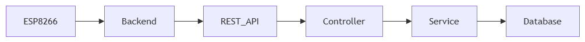
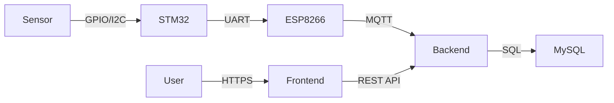
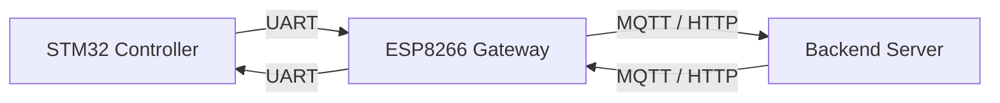
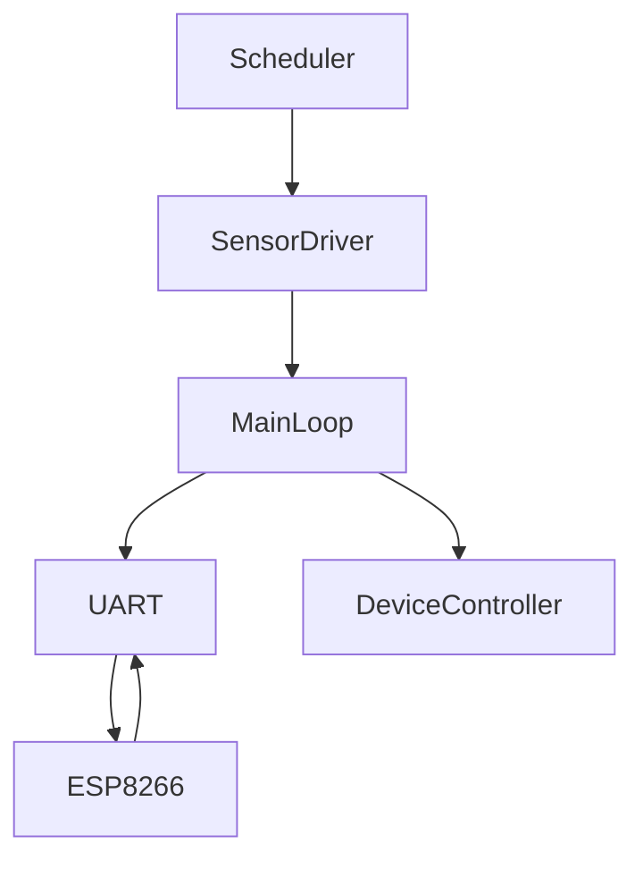
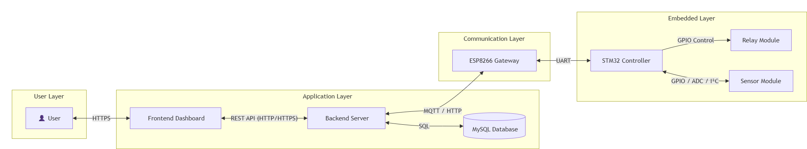
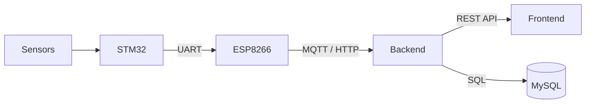
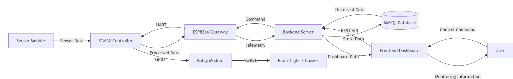
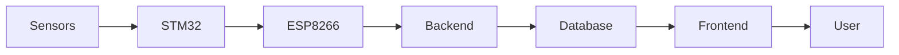
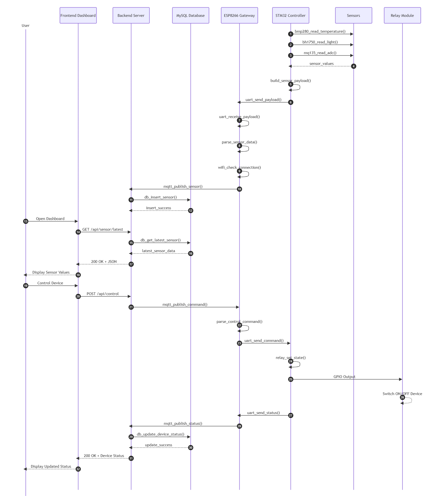

# 1. Introduction

## 1.1 Purpose

The purpose of this document is to describe the overall software architecture of the IoT Laboratory Monitoring and Control System. It provides a comprehensive view of the system structure, software components, communication mechanisms, and operational workflows implemented throughout the project.

This document serves as the primary architectural reference for developers, maintainers, and project stakeholders. It explains how the Frontend Dashboard, Backend Server, ESP8266 Gateway, STM32 Controller, Database, and embedded hardware collaborate to provide real-time environmental monitoring and remote laboratory device control.

The Architecture Document also defines the responsibilities of each subsystem, the communication interfaces between software components, and the overall data flow across the entire IoT platform.

---

## 1.2 Scope

This document covers the complete software architecture of the IoT Laboratory Monitoring and Control System.

The document includes:

- Overall system architecture
- Frontend software architecture
- Backend software architecture
- ESP8266 Gateway architecture
- STM32 Controller architecture
- Communication architecture
- Data flow architecture
- System operation sequence
- Deployment architecture
- System design characteristics

Implementation details of individual source files and APIs are documented separately in their corresponding technical documents.

---

## 1.3 Objectives

The proposed architecture is designed to achieve the following objectives:

- Provide a modular and maintainable software structure
- Separate presentation, application, communication, and embedded control layers
- Support real-time environmental monitoring
- Enable remote laboratory equipment control
- Improve software scalability and maintainability
- Simplify future hardware and software expansion
- Clearly define responsibilities of each software component

---

## 1.4 Intended Audience

This document is intended for:

- Software developers
- Embedded system developers
- Backend developers
- Frontend developers
- Project supervisors
- Future maintenance engineers

Readers are expected to have a basic understanding of embedded systems, IoT communication, and client-server architectures.
# 2. System Overview

The IoT Laboratory Monitoring and Control System is designed to continuously monitor environmental conditions inside a laboratory while providing remote control of electrical devices through a web-based application.

The system integrates embedded hardware, wireless communication, backend services, database management, and frontend visualization into a unified architecture.

Environmental parameters including temperature, humidity, and light intensity are collected by sensors connected to the STM32 controller. The STM32 periodically acquires sensor measurements, processes the collected information, and transmits sensor data to the ESP8266 gateway through UART communication.

The ESP8266 gateway establishes wireless network connectivity and forwards environmental information to the backend server using MQTT or HTTP protocols. The backend validates incoming data, stores historical records in a MySQL database, and exposes REST APIs that allow frontend applications to visualize environmental conditions in real time.

Users interact with the system through a responsive web dashboard. Besides monitoring environmental information, users may remotely control laboratory equipment such as fans, lighting systems, and alarm buzzers. Control commands are transmitted from the frontend to the backend, forwarded through the ESP8266 gateway, and finally executed by the STM32 controller via the relay module.

The proposed architecture follows a layered design that separates sensing, communication, application services, and presentation. This separation improves system maintainability, scalability, and overall reliability.
# 3. Overall System Architecture
...

**Figure 3-1. Overall System Architecture**

The proposed architecture follows a layered design...
The overall architecture adopts a layered design that separates user interaction, application services, communication mechanisms, and embedded hardware.

The system consists of four logical layers:

- User Layer
- Application Layer
- Communication Layer
- Embedded Layer

This layered architecture reduces software coupling while improving modularity and maintainability.
### 3.1 User Layer

The User Layer represents the interface through which laboratory administrators and users interact with the monitoring system.

Users access the platform using a web browser and perform various monitoring and control operations through the Frontend Dashboard.

Major responsibilities include:

- Viewing real-time environmental information
- Monitoring device status
- Sending remote control commands
- Configuring operating parameters
- Receiving system notifications and alerts
### 3.2 Application Layer

The Application Layer performs business logic processing and data management.

This layer consists of three major software components:

- Frontend Dashboard
- Backend Server
- MySQL Database

The Backend Server functions as the central processing component responsible for:

- Processing REST API requests
- Managing user authentication
- Processing sensor information
- Managing historical records
- Communicating with the ESP8266 Gateway
- Coordinating remote control operations

The MySQL database stores environmental measurements, device status information, user accounts, and historical monitoring data.
### 3.3 Communication Layer

The Communication Layer is implemented by the ESP8266 Gateway.

The ESP8266 serves as the communication bridge between the embedded STM32 controller and the backend server.

Its primary responsibilities include:

- Establishing WiFi connectivity
- Receiving UART packets from STM32
- Publishing sensor information using MQTT or HTTP
- Receiving remote control commands from the backend
- Forwarding control commands to STM32

Separating communication functionality from the STM32 controller simplifies firmware design and allows flexible network deployment.
### 3.4 Embedded Layer

The Embedded Layer performs environmental sensing and laboratory equipment control.

Major hardware components include:

- STM32 Controller
- Temperature Sensor
- Humidity Sensor
- Light Sensor
- Relay Module
- Fan
- Lighting System
- Alarm Buzzer

The STM32 periodically reads sensor measurements, processes environmental information, and communicates with the ESP8266 Gateway through UART.

When remote control commands are received from the backend, the STM32 updates relay outputs to operate laboratory equipment.
### 3.5 Layer Interaction

The interaction among software layers follows a hierarchical communication model.

Environmental monitoring data flows upward from embedded sensors to users through the communication and application layers.

Conversely, remote control commands travel downward from users to laboratory equipment through the backend server, ESP8266 gateway, and STM32 controller.

This layered interaction minimizes dependencies between software modules and improves overall maintainability.
# 4. Frontend Architecture

The Frontend is the presentation layer of the IoT Laboratory Monitoring and Control System. It provides users with an intuitive web-based interface for monitoring environmental conditions and controlling laboratory devices in real time.

The frontend communicates exclusively with the Backend Server through RESTful APIs. It does not directly communicate with embedded devices such as the STM32 controller or the ESP8266 gateway. This design follows the principle of separation of concerns, allowing the user interface to remain independent of hardware implementation details.

The frontend is responsible for presenting sensor measurements, visualizing historical data, displaying device status, and forwarding user control commands to the backend.

---

## 4.1 Frontend Responsibilities

The major responsibilities of the frontend include:

- Displaying real-time environmental information
- Visualizing historical sensor data
- Monitoring device operating status
- Providing device control interfaces
- Managing user authentication
- Displaying system notifications and alerts
- Sending user requests to the Backend Server through REST APIs

The frontend focuses entirely on presentation and user interaction while leaving all business logic and data processing to the backend.

---

## 4.2 Frontend Components

The frontend consists of several functional modules.

### Dashboard

The Dashboard provides an overview of the laboratory environment by displaying:

- Temperature
- Humidity
- Light intensity
- Device status
- Recent notifications

The dashboard is continuously updated using data retrieved from the backend server.

---

### Monitoring Module

The Monitoring Module visualizes environmental information collected from the embedded system.

Functions include:

- Real-time sensor display
- Historical data visualization
- Environmental trend monitoring
- Threshold warning display

Sensor data is retrieved through REST APIs exposed by the backend.

---

### Device Control Module

The Device Control Module allows users to remotely operate laboratory equipment.

Supported devices include:

- Fan
- Lighting
- Alarm Buzzer

When users issue a control command, the frontend sends an HTTP request to the backend server, which subsequently forwards the command to the embedded system.

---

### Authentication Module

The Authentication Module manages user access.

Its responsibilities include:

- User login
- Session management
- Authentication validation
- Access control

Authentication information is verified by the backend before allowing access to protected resources.

---

## 4.3 Frontend Communication

The frontend communicates only with the backend.

## 4.4 User Interface Workflow

The interaction between users and the system follows a simple request-response workflow. Users access the web dashboard through a browser, where the frontend communicates with the backend to retrieve monitoring data and submit control requests.

The workflow consists of the following steps:

1. The user opens the web dashboard.
2. The frontend requests environmental information from the Backend Server through REST APIs.
3. The Backend retrieves sensor data from the MySQL database.
4. The Backend returns the requested information in JSON format.
5. The frontend updates the dashboard interface with the latest environmental conditions.
6. When a user performs a control operation, the frontend sends the corresponding request to the Backend Server.
7. The Backend forwards the command to the ESP8266 gateway, which subsequently transmits the command to the STM32 controller.
8. The STM32 controller updates the relay outputs and executes the requested operation.
9. The updated device status is returned to the frontend for visualization.

This workflow ensures that all interactions between users and embedded devices are coordinated through the Backend Server, maintaining a clear separation between presentation and hardware control.

---

## 4.5 Frontend Advantages

The proposed frontend architecture provides several advantages.

- Clear separation between presentation and business logic.
- Responsive and user-friendly web interface.
- Easy integration with RESTful APIs.
- Real-time visualization of environmental information.
- Support for remote monitoring and device control.
- Scalable page organization for future system expansion.
- Improved maintainability through modular component design.

The frontend architecture enables users to efficiently monitor laboratory conditions while interacting with the embedded system through a unified web interface.
# 5. Backend Architecture

The Backend Server acts as the core processing component of the IoT Laboratory Monitoring and Control System. It is responsible for receiving environmental data from embedded devices through the ESP8266 gateway, processing incoming information, storing historical records, and providing REST APIs for frontend applications.

The backend serves as the communication bridge between the web application, database, and embedded system. It centralizes business logic, ensuring reliable data processing, user authentication, device management, and remote control operations.

---

## 5.1 Backend Responsibilities

The Backend Server performs the following responsibilities:

- Receive environmental monitoring data from the ESP8266 gateway.
- Validate incoming sensor data before storage.
- Store monitoring records in the MySQL database.
- Provide RESTful APIs for frontend applications.
- Manage user authentication and authorization.
- Process device control requests.
- Generate alert notifications when environmental thresholds are exceeded.
- Maintain historical monitoring records.
- Coordinate communication between the web application and embedded devices.

The backend represents the central business logic layer of the entire IoT platform.

---

## 5.2 Backend Software Architecture

The backend adopts a layered software architecture that separates request handling, business logic, data access, and database management.

The software architecture consists of five logical layers:

- REST API Layer
- Controller Layer
- Service Layer
- Repository Layer
- Database Layer

This layered organization improves software maintainability, scalability, and modularity.

---

### REST API Layer

The REST API Layer exposes HTTP endpoints that allow frontend applications to communicate with the backend.

Its responsibilities include:

- Receiving HTTP requests.
- Returning JSON responses.
- Request validation.
- Authentication verification.
- API routing.

This layer provides a standardized communication interface for external applications.

---

### Controller Layer

The Controller Layer receives requests from the REST API layer and delegates processing tasks to the Service Layer.

Major responsibilities include:

- Request routing.
- Parameter validation.
- Response formatting.
- Exception handling.

Controllers contain minimal business logic, ensuring a clean separation between application flow and system functionality.

---

### Service Layer

The Service Layer implements the core business logic of the monitoring system.

Its responsibilities include:

- Sensor data processing.
- Environmental threshold checking.
- Alert generation.
- Device management.
- Historical data analysis.
- Processing remote control commands.

The Service Layer coordinates interactions between the Controller Layer and the Repository Layer.

---

### Repository Layer

The Repository Layer provides an abstraction for database access.

Its responsibilities include:

- CRUD operations.
- SQL execution.
- Data retrieval.
- Data persistence.
- Database transaction management.

This abstraction isolates business logic from database implementation details.

---

### Database Layer

The Database Layer stores all persistent system information.

Information stored includes:

- Environmental sensor measurements.
- Device operating status.
- User account information.
- Alert records.
- Historical monitoring data.

MySQL is selected due to its reliability, scalability, and compatibility with the backend framework.

---

## 5.3 Backend Communication

The Backend communicates with three primary system components:

- ESP8266 Gateway
- Frontend Dashboard
- MySQL Database

The communication architecture is illustrated below.

The Backend never communicates directly with sensors or relay hardware. All embedded communication is performed through the ESP8266 gateway.

---

## 5.4 Backend Processing Workflow

The Backend processes two major categories of requests:

### Environmental Monitoring

1. STM32 acquires environmental measurements.
2. Sensor data is transmitted to the ESP8266 gateway through UART.
3. ESP8266 forwards environmental information to the Backend using MQTT or HTTP.
4. The Backend validates incoming data.
5. Valid sensor data is stored in the MySQL database.
6. Updated information becomes available through REST APIs.
7. The Frontend retrieves the latest environmental data for visualization.

### Device Control

1. The user submits a control request through the Frontend Dashboard.
2. The Frontend sends the request to the Backend Server.
3. The Backend validates the command.
4. The Backend forwards the command to the ESP8266 gateway.
5. ESP8266 transmits the command to the STM32 controller via UART.
6. STM32 controls the corresponding relay output.
7. Updated device status is returned to the Backend.
8. The Frontend displays the latest device status.

---

## 5.5 Backend Advantages

The proposed backend architecture provides several advantages:

- Centralized business logic.
- Layered software organization.
- Easy maintenance and debugging.
- Database abstraction.
- Reliable REST API services.
- High scalability.
- Secure communication management.
- Simplified future system expansion.

The backend serves as the central coordinator of the IoT platform, ensuring reliable communication between embedded hardware and web applications while maintaining system scalability and maintainability.
# 6. ESP8266 Gateway Architecture

The ESP8266 module serves as the communication gateway of the IoT Laboratory Monitoring and Control System. It provides wireless network connectivity between the embedded STM32 controller and the Backend Server.

Rather than performing sensor acquisition or device control, the ESP8266 is responsible for forwarding environmental monitoring data collected by the STM32 controller to the backend server through WiFi communication. It also receives remote control commands from the backend and forwards them to the STM32 controller through UART communication.

By separating communication functionality from the embedded controller, the system achieves improved modularity, flexibility, and maintainability.

---

## 6.1 ESP8266 Responsibilities

The ESP8266 Gateway performs the following responsibilities:

- Establish WiFi network connectivity.
- Receive sensor data from the STM32 controller through UART.
- Package environmental information into network messages.
- Publish sensor data to the Backend Server using MQTT or HTTP protocols.
- Receive remote control commands from the Backend Server.
- Forward control commands to the STM32 controller through UART.
- Monitor communication status.
- Handle communication errors and reconnection.

The ESP8266 focuses exclusively on communication and networking while leaving sensing and hardware control to the STM32 controller.

---

## 6.2 Software Architecture

The ESP8266 firmware consists of several software modules that cooperate to provide reliable communication services.

The major software modules include:

- WiFi Manager
- MQTT / HTTP Client
- UART Driver
- Command Parser
- Communication Manager

Each module has clearly defined responsibilities to improve maintainability and simplify future software updates.

---

### WiFi Manager

The WiFi Manager establishes and maintains wireless network connectivity.

Responsibilities include:

- Connecting to the configured WiFi network.
- Monitoring connection status.
- Automatically reconnecting when the connection is lost.
- Managing network configuration.

Reliable WiFi communication is essential for continuous environmental monitoring.

---

### MQTT / HTTP Client

The MQTT / HTTP Client exchanges information with the Backend Server.

Responsibilities include:

- Publishing sensor data.
- Receiving remote control commands.
- Formatting application messages.
- Maintaining communication sessions.

Depending on deployment requirements, either MQTT or HTTP may be used as the communication protocol.

---

### UART Driver

The UART Driver provides serial communication between the ESP8266 Gateway and the STM32 controller.

Responsibilities include:

- Receiving sensor packets from STM32.
- Transmitting control commands to STM32.
- Buffer management.
- Error detection.

UART communication provides a simple and reliable interface between the communication gateway and the embedded controller.

---

### Command Parser

The Command Parser interprets incoming commands received from the Backend Server.

Responsibilities include:

- Parsing command packets.
- Verifying command validity.
- Forwarding valid commands to STM32.
- Rejecting invalid messages.

The parser ensures communication consistency between network messages and embedded commands.

---

### Communication Manager

The Communication Manager coordinates all communication activities within the ESP8266 firmware.

Responsibilities include:

- Scheduling communication tasks.
- Managing message transmission.
- Handling communication failures.
- Coordinating UART and WiFi communication.

This module improves communication reliability under unstable network conditions.

---

## 6.3 Communication Workflow

The ESP8266 operates as an intermediate gateway between the embedded controller and the Backend Server.

The communication process consists of two independent workflows.

### Sensor Data Upload

1. STM32 acquires environmental measurements.
2. STM32 sends sensor packets through UART.
3. ESP8266 receives UART packets.
4. Sensor data is formatted into MQTT or HTTP messages.
5. Environmental information is transmitted to the Backend Server.
6. The Backend stores monitoring records in the database.

---

### Remote Device Control

1. User submits a control request.
2. Backend validates the request.
3. Backend sends the command to the ESP8266.
4. ESP8266 parses the received message.
5. The command is transmitted to STM32 through UART.
6. STM32 updates relay outputs.
7. Device status is returned to the Backend Server.

---

## 6.4 Communication Interfaces

The ESP8266 communicates with two external components.

The ESP8266 never directly accesses sensors or relay modules. All hardware interaction is delegated to the STM32 controller.

---

## 6.5 Advantages

The ESP8266 Gateway architecture provides several advantages:

- Separation of communication and embedded control.
- Reliable wireless connectivity.
- Simplified STM32 firmware.
- Modular communication implementation.
- Easy migration between MQTT and HTTP protocols.
- Automatic network reconnection.
- Improved scalability for future IoT expansion.

The ESP8266 Gateway acts as a dedicated communication bridge that enables reliable interaction between embedded hardware and cloud-based application services.
# 7. STM32 Controller Architecture

The STM32 Controller serves as the core embedded processing unit of the IoT Laboratory Monitoring and Control System. It is responsible for acquiring environmental data from multiple sensors, processing sensor measurements, controlling laboratory devices through relay outputs, and communicating with the ESP8266 Gateway.

Unlike the ESP8266, which focuses on wireless communication, the STM32 performs all real-time hardware operations including sensor sampling, actuator control, data formatting, and command execution.

The controller operates continuously to ensure accurate environmental monitoring and reliable equipment control.

---

## 7.1 STM32 Responsibilities

The STM32 Controller performs the following responsibilities:

- Acquire environmental measurements from sensors.
- Process raw sensor readings.
- Control relay outputs.
- Execute remote control commands.
- Format sensor data packets.
- Communicate with the ESP8266 Gateway through UART.
- Monitor device operating status.
- Schedule periodic sensing tasks.

The STM32 acts as the central controller of the embedded subsystem.

---

## 7.2 Hardware Components

The STM32 controller interfaces with multiple hardware peripherals.

Major hardware components include:

- STM32 Microcontroller
- Temperature Sensor
- Humidity Sensor
- Light Sensor
- Relay Module
- Fan
- Lighting System
- Alarm Buzzer
- UART Interface

Each peripheral performs a dedicated function while the STM32 coordinates all hardware activities.

---

## 7.3 Software Architecture

The firmware adopts a modular software architecture that separates hardware abstraction, application logic, communication, and device control.

The firmware consists of the following major modules:

- Sensor Driver
- Device Controller
- UART Communication
- Scheduler
- Main Control Loop

This modular organization improves maintainability and simplifies future firmware development.

---

### Sensor Driver

The Sensor Driver manages communication with all environmental sensors connected to the STM32.

Responsibilities include:

- Sensor initialization.
- Periodic sensor sampling.
- Reading raw measurements.
- Basic sensor validation.
- Providing processed values to the application layer.

The driver isolates hardware-specific operations from application logic.

---

### Device Controller

The Device Controller manages laboratory equipment connected through the relay module.

Responsibilities include:

- Fan control.
- Lighting control.
- Alarm buzzer control.
- Relay switching.
- Device status monitoring.

Control commands received from the Backend Server are executed through this module.

---

### UART Communication Module

The UART module provides serial communication between STM32 and ESP8266.

Responsibilities include:

- Sensor packet transmission.
- Command reception.
- Packet formatting.
- UART buffer management.
- Communication error handling.

The UART interface provides reliable communication between embedded hardware and the communication gateway.

---

### Scheduler

The Scheduler coordinates periodic software execution.

Responsibilities include:

- Sensor sampling interval.
- Communication interval.
- Device status update.
- Timing management.
- Periodic task scheduling.

Separating scheduling from application logic improves firmware readability and scalability.

---

### Main Control Loop

The Main Control Loop coordinates the interaction among all firmware modules.

Responsibilities include:

- Reading sensors.
- Processing environmental data.
- Updating device status.
- Sending monitoring packets.
- Executing received commands.

The Main Control Loop ensures continuous operation of the embedded controller.

---

## 7.4 Sensor Acquisition Workflow

The environmental monitoring process consists of the following stages:

1. Scheduler triggers sensor acquisition.
2. Sensor Driver reads environmental sensors.
3. Raw sensor values are processed.
4. Environmental information is formatted into a UART packet.
5. UART module transmits the packet to the ESP8266 Gateway.

This workflow is executed periodically to provide continuous environmental monitoring.

---

## 7.5 Device Control Workflow

The remote control process follows the sequence below:

1. ESP8266 receives a control command from the Backend Server.
2. The command is forwarded to STM32 through UART.
3. UART Communication Module receives the command.
4. Command validity is verified.
5. Device Controller updates the corresponding relay output.
6. Device status is refreshed.
7. Updated status is transmitted back to the ESP8266 Gateway.

This workflow enables reliable remote operation of laboratory equipment.

---

## 7.6 Internal Module Interaction

The interaction among STM32 firmware modules is illustrated below.

The Scheduler periodically activates sensor acquisition, while the Main Control Loop coordinates communication and device control.

---

## 7.7 Advantages

The STM32 firmware architecture provides several advantages:

- Modular software organization.
- Separation of hardware drivers and application logic.
- Reliable UART communication.
- Real-time environmental monitoring.
- Simplified firmware maintenance.
- Easy integration of additional sensors.
- Flexible support for future laboratory devices.

The modular architecture also facilitates independent development of sensing, communication, and control modules without affecting the overall firmware structure.
# 8. Communication Architecture

**Figure 8-1. Communication Architecture**
The Communication Architecture defines how information is exchanged among the major software and hardware components of the IoT Laboratory Monitoring and Control System.

The architecture adopts a multi-layer communication model in which different protocols are selected according to the characteristics of each communication interface. This design improves communication reliability, modularity, and interoperability while minimizing coupling between system components.

---

## 8.1 Communication Overview

The system communication involves four major interfaces:

- STM32 Controller ↔ ESP8266 Gateway
- ESP8266 Gateway ↔ Backend Server
- Frontend Dashboard ↔ Backend Server
- Backend Server ↔ MySQL Database

Each interface uses an appropriate communication protocol depending on transmission requirements.

---

## 8.2 Communication Architecture

The communication architecture separates embedded communication from web communication, allowing each subsystem to evolve independently.

---

## 8.3 UART Communication

UART communication is used between the STM32 Controller and the ESP8266 Gateway.

UART provides:

- Reliable serial communication
- Low implementation complexity
- Low communication overhead
- Stable embedded device connectivity

The STM32 periodically packages sensor measurements into UART frames before transmitting them to the ESP8266 Gateway.

Similarly, remote control commands received by the ESP8266 are forwarded to the STM32 using the same UART interface.

---

## 8.4 MQTT / HTTP Communication

The ESP8266 communicates with the Backend Server using either MQTT or HTTP protocols.

Environmental monitoring data is uploaded to the Backend Server through wireless communication.

Responsibilities include:

- Sensor data upload
- Remote command reception
- Communication status monitoring
- Automatic reconnection

Using standard IoT communication protocols simplifies future cloud deployment.

---

## 8.5 REST API Communication

The Frontend Dashboard communicates with the Backend Server through RESTful APIs.

REST APIs provide:

- Environmental monitoring requests
- Historical data retrieval
- Device control requests
- Authentication services

JSON is used as the standard data exchange format.

---

## 8.6 Database Communication

The Backend Server communicates with the MySQL database using SQL queries.

Typical database operations include:

- Insert sensor records
- Retrieve historical measurements
- Update device status
- Manage user accounts
- Store alert information

The Repository Layer abstracts SQL implementation from business logic.

---

## 8.7 Communication Advantages

The communication architecture provides:

- Standardized communication interfaces.
- Clear protocol separation.
- Reliable embedded communication.
- Flexible cloud integration.
- Easy maintenance.
- Future scalability.
# 9. Data Flow Architecture

**Figure 9-1. System Data Flow**
The Data Flow Architecture describes how information travels through the IoT Laboratory Monitoring and Control System during monitoring and control operations.

Two independent data flows exist within the system:

- Environmental Monitoring Flow
- Remote Device Control Flow

---

## 9.1 Environmental Monitoring Flow

The environmental monitoring process begins with sensor acquisition and ends with real-time visualization on the web dashboard.

The monitoring workflow consists of the following steps:

1. Environmental sensors collect laboratory measurements.
2. STM32 reads sensor values.
3. Sensor measurements are processed.
4. UART packets are transmitted to ESP8266.
5. ESP8266 uploads data using MQTT or HTTP.
6. Backend validates incoming information.
7. Sensor records are stored in MySQL.
8. Frontend requests updated information.
9. Users monitor environmental conditions through the dashboard.

---

## 9.2 Remote Control Flow

Remote control follows the reverse communication direction.

The control process consists of:

1. User submits a control request.
2. Frontend sends the request through REST APIs.
3. Backend validates the command.
4. ESP8266 receives the command.
5. UART forwards the command to STM32.
6. STM32 updates relay outputs.
7. Laboratory equipment changes operating state.
8. Updated status is reported back to the backend.

---

## 9.3 Data Integrity

The system maintains data integrity by:

- Validating incoming sensor values.
- Verifying communication packets.
- Confirming command execution.
- Recording historical events.
- Synchronizing device status.

These mechanisms improve communication reliability throughout the IoT platform.
# 10. System Operation Sequence
## 10.1 Monitoring Sequence

The monitoring process follows these steps:

1. STM32 periodically acquires environmental measurements.
2. Sensor data is processed locally.
3. STM32 sends UART packets to ESP8266.
4. ESP8266 publishes sensor information.
5. Backend receives environmental data.
6. Sensor records are stored in MySQL.
7. Frontend requests updated information.
8. Backend returns JSON responses.
9. Dashboard displays real-time monitoring information.

---

## 10.2 Device Control Sequence

The remote control sequence consists of:

1. User selects a laboratory device.
2. Frontend submits a control request.
3. Backend validates the request.
4. ESP8266 receives the control command.
5. UART forwards the command to STM32.
6. STM32 updates relay outputs.
7. Device state changes.
8. Updated status is transmitted back to the Backend.
9. Dashboard refreshes the displayed device status.

---

## 10.3 Sequence Characteristics

The proposed sequence ensures:

- Reliable command execution.
- Real-time monitoring.
- Consistent device status.
- Clear separation between communication and embedded control.
- Scalable interaction among software components.
# 11. Deployment Architecture

The Deployment Architecture describes how the software components are physically deployed across the hardware infrastructure of the IoT Laboratory Monitoring and Control System. Unlike the logical architecture presented in previous chapters, this section focuses on the execution environment of each component and the communication channels established between them.

The system adopts a distributed deployment model in which sensing, communication, application processing, and user interaction are executed on independent hardware platforms. This deployment strategy improves scalability, simplifies maintenance, and allows each subsystem to be upgraded independently.

---

## 11.1 Deployment Overview

The complete system is deployed on five major physical components:

- Client Device
- Backend Server
- MySQL Database Server
- ESP8266 Gateway
- STM32 Embedded Controller

Each component executes a dedicated part of the software architecture while communicating through standardized interfaces.

---

## 11.2 Deployment Diagram

**Figure 11-1. Physical Deployment Architecture**

The deployment diagram illustrates the physical locations of each software component together with the communication protocols used between them.

---

## 11.3 Client Device

The Client Device represents any computer, laptop, tablet, or smartphone capable of accessing the monitoring dashboard through a modern web browser.

The client is responsible for:

- Displaying real-time monitoring information.
- Viewing historical environmental data.
- Sending remote control requests.
- Receiving system notifications.
- Managing user interactions.

The client communicates exclusively with the Backend Server through REST APIs over the Internet.

---

## 11.4 Backend Server

The Backend Server hosts the core application responsible for business logic and system management.

Major responsibilities include:

- Processing REST API requests.
- Receiving environmental monitoring data.
- Managing user authentication.
- Executing business logic.
- Coordinating communication with embedded devices.
- Providing monitoring services for frontend applications.

The backend operates independently from the embedded hardware and serves as the central management platform of the entire IoT system.

---

## 11.5 MySQL Database Server

The MySQL Database stores all persistent information generated by the monitoring system.

Stored information includes:

- Sensor measurements.
- Device operating status.
- User accounts.
- Alert records.
- Historical monitoring data.

The Backend Server communicates directly with the database through SQL queries using the Repository Layer.

---

## 11.6 ESP8266 Gateway

The ESP8266 Gateway provides wireless communication between the embedded controller and the Backend Server.

Responsibilities include:

- Establishing WiFi connectivity.
- Receiving UART packets from STM32.
- Publishing environmental data using MQTT or HTTP.
- Receiving remote control commands.
- Forwarding commands to STM32.

The ESP8266 is deployed together with the embedded controller and operates continuously as the communication gateway.

---

## 11.7 STM32 Embedded Controller

The STM32 Controller is deployed within the laboratory environment and interfaces directly with sensors and actuators.

Its responsibilities include:

- Acquiring environmental data.
- Processing sensor measurements.
- Executing remote control commands.
- Controlling relay outputs.
- Communicating with the ESP8266 Gateway.

The controller performs all real-time embedded operations while delegating wireless communication to the ESP8266.

---

## 11.8 Deployment Communication

The deployed components communicate through multiple communication technologies.

| Source | Destination | Protocol |
|---------|-------------|----------|
| Client Device | Backend Server | REST API (HTTP/HTTPS) |
| Backend Server | MySQL Database | SQL |
| Backend Server | ESP8266 Gateway | MQTT / HTTP |
| ESP8266 Gateway | STM32 Controller | UART |
| STM32 Controller | Sensors | GPIO / I2C / ADC |
| STM32 Controller | Relay Module | GPIO |

Each communication protocol is selected according to the performance and reliability requirements of the corresponding subsystem.

---

## 11.9 Deployment Advantages

The distributed deployment architecture provides several advantages:

- Independent deployment of software components.
- Improved system scalability.
- Simplified maintenance and software updates.
- Better fault isolation between subsystems.
- Flexible replacement of hardware components.
- Easy integration of additional embedded nodes.
- Support for future cloud deployment.

The proposed deployment architecture ensures reliable operation while allowing the monitoring platform to expand with minimal architectural changes.
# 12. Design Characteristics

The IoT Laboratory Monitoring and Control System is designed based on modern software engineering principles to ensure maintainability, scalability, reliability, and flexibility. The architecture separates hardware control, communication, application services, and user interaction into independent modules, allowing each subsystem to evolve with minimal impact on the rest of the system.

The following design characteristics summarize the major architectural decisions adopted throughout the project.

---

## 12.1 Layered Architecture

The system adopts a layered architecture consisting of four logical layers:

- User Layer
- Application Layer
- Communication Layer
- Embedded Layer

Each layer performs a dedicated responsibility and communicates only through well-defined interfaces.

This separation reduces software complexity and improves overall maintainability.

---

## 12.2 Modular Design

Each subsystem is implemented as an independent software module.

Major modules include:

- Frontend Dashboard
- Backend Server
- Database Layer
- ESP8266 Gateway
- STM32 Controller

Each module can be developed, tested, and maintained independently without significantly affecting other parts of the system.

The modular organization also simplifies debugging and future software upgrades.

---

## 12.3 Loose Coupling

The system minimizes dependencies among components by using standardized communication interfaces.

Examples include:

- REST API between Frontend and Backend
- MQTT / HTTP between Backend and ESP8266
- UART between ESP8266 and STM32
- SQL between Backend and Database

Loose coupling enables components to be modified or replaced without requiring major architectural changes.

---

## 12.4 Scalability

The proposed architecture supports future system expansion.

Examples include:

- Adding new environmental sensors.
- Supporting additional relay-controlled devices.
- Deploying multiple monitoring nodes.
- Integrating cloud platforms.
- Supporting mobile applications.
- Extending monitoring services.

Because communication interfaces remain unchanged, new modules can be integrated with minimal software modification.

---

## 12.5 Maintainability

Maintainability is achieved through:

- Layer separation.
- Modular firmware organization.
- Driver abstraction.
- Independent communication modules.
- Standardized software interfaces.

This organization reduces software complexity and facilitates long-term maintenance.

---

## 12.6 Reliability

Several mechanisms improve system reliability:

- Periodic sensor sampling.
- UART communication validation.
- Automatic WiFi reconnection.
- Backend request validation.
- Database persistence.
- Device status synchronization.

These mechanisms ensure stable operation during continuous monitoring.

---

## 12.7 Performance

The architecture is optimized for real-time monitoring.

Key characteristics include:

- Lightweight UART communication.
- Efficient REST API services.
- Fast database operations.
- Independent embedded processing.
- Low communication latency.

Environmental information can therefore be updated continuously while maintaining responsive device control.

---

## 12.8 Security Considerations

Basic security mechanisms include:

- User authentication.
- Backend request validation.
- Access control.
- Database protection.

Future improvements may include:

- HTTPS communication.
- JWT authentication.
- Role-Based Access Control (RBAC).
- TLS encryption for MQTT communication.
# 13. Conclusion

This document presented the complete software architecture of the IoT Laboratory Monitoring and Control System.

The architecture integrates embedded hardware, wireless communication, backend services, database management, and web technologies into a unified monitoring platform capable of providing real-time environmental monitoring and remote laboratory device control.

The STM32 Controller performs environmental sensing and device control, while the ESP8266 Gateway provides reliable wireless communication with the Backend Server. The Backend Server acts as the central processing unit responsible for business logic, data management, REST API services, and communication coordination. Finally, the Frontend Dashboard offers users an intuitive interface for monitoring environmental conditions and controlling laboratory equipment remotely.

By adopting a layered and modular architecture, the system achieves:

- Clear separation of responsibilities.
- Improved maintainability.
- High scalability.
- Reliable communication.
- Flexible software expansion.
- Simplified future development.

The proposed architecture establishes a solid foundation for future enhancements, including cloud deployment, multiple monitoring nodes, additional environmental sensors, advanced analytics, and intelligent laboratory management services.

Overall, the architecture satisfies the functional and non-functional requirements defined for the project while providing a maintainable and extensible software platform suitable for real-world IoT monitoring applications.