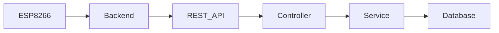
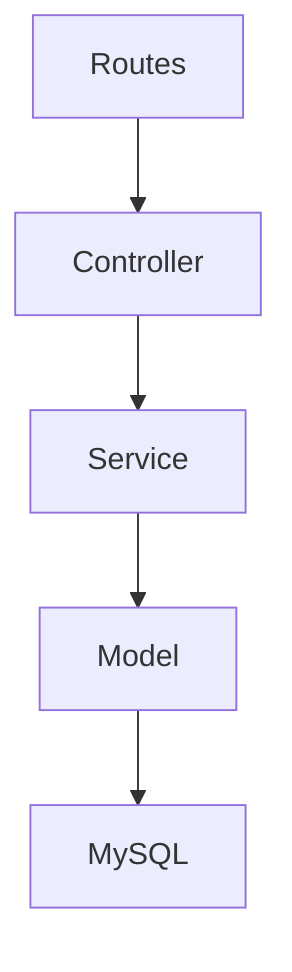
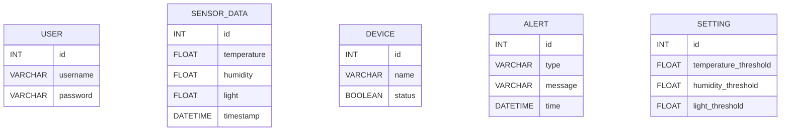
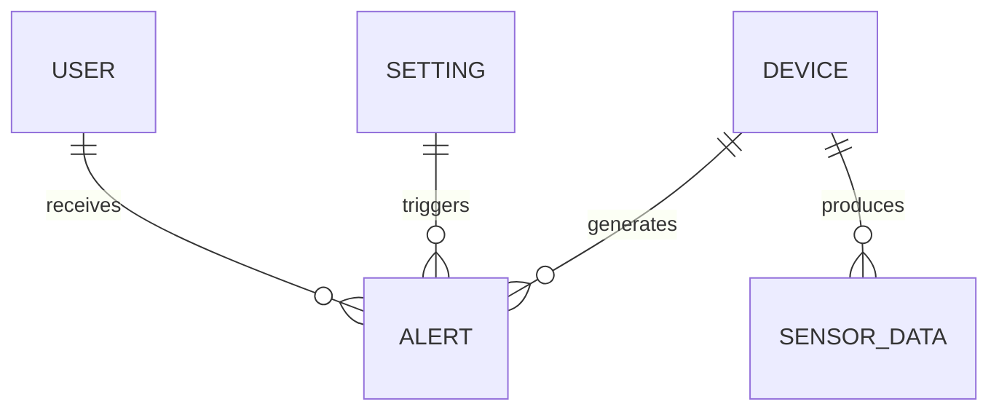
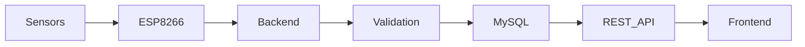
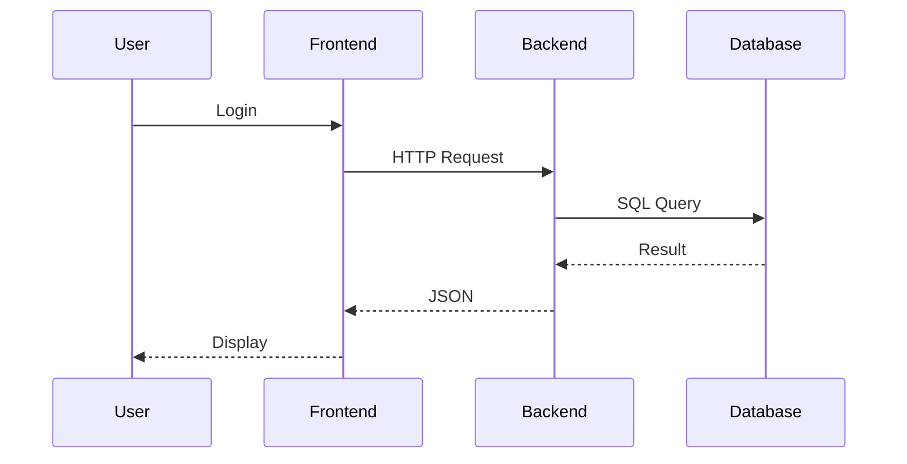
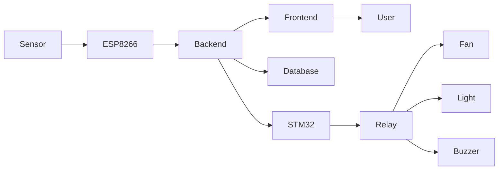
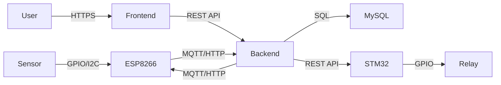

# Backend Architecture

## 1. Overview
The Backend is responsible for receiving, processing, storing, and providing environmental monitoring data collected from IoT devices deployed in the laboratory. It acts as the central communication layer between ESP8266 monitoring nodes, STM32 control nodes, the database, and the web-based dashboard.

The backend system receives sensor data including temperature, humidity, and light intensity from ESP8266 through network communication protocols. After validating and processing the received data, the system stores it in a MySQL database and provides REST APIs for the frontend dashboard to retrieve real-time and historical information.

In addition, the backend manages alert generation, device status monitoring, threshold configuration, and data access services to support automatic control and user interaction. The architecture is designed to be scalable, maintainable, and suitable for future expansion of additional sensors and monitoring nodes.

## 2. Backend Architecture

## 3. MVC

## 4. Database Selection
### Database
MySQL

### Reasons
- Open Source
- Stable
- Relational Database
- Suitable for IoT Applications
- Easy Backup and Recovery
- Good NodeJS Integration

## 5. Database Schema

## 5.1 Database Relationships

### Relationship Description

- Each Device generates multiple Sensor Data records.
- Devices may generate alert events when monitored values exceed configured thresholds.
- System Settings define threshold values used to trigger alerts.
- Users receive and monitor alert notifications through the dashboard.

## 6. Data Storage Flow

## 6.1 Data Storage Strategy

Sensor data collected from ESP8266 monitoring nodes is transmitted directly to the backend server through MQTT/HTTP communication. The backend validates incoming data before storing it in the MySQL database.

Environmental data including temperature, humidity, and light intensity is recorded periodically to support real-time monitoring and historical analysis.

Alert events are stored separately to maintain a complete event history and support notification services. Device status changes are also logged to assist system monitoring and troubleshooting.

The storage design ensures data consistency, scalability, and efficient retrieval for dashboard visualization and reporting.

## 7. REST API Flow

## 8. Component Relationship

## 9. Communication Protocol
