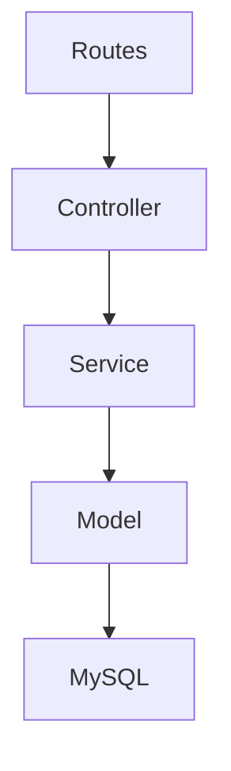
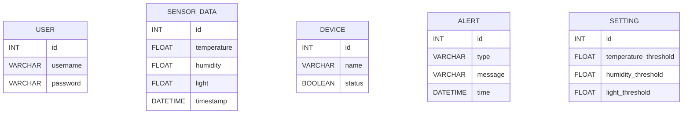
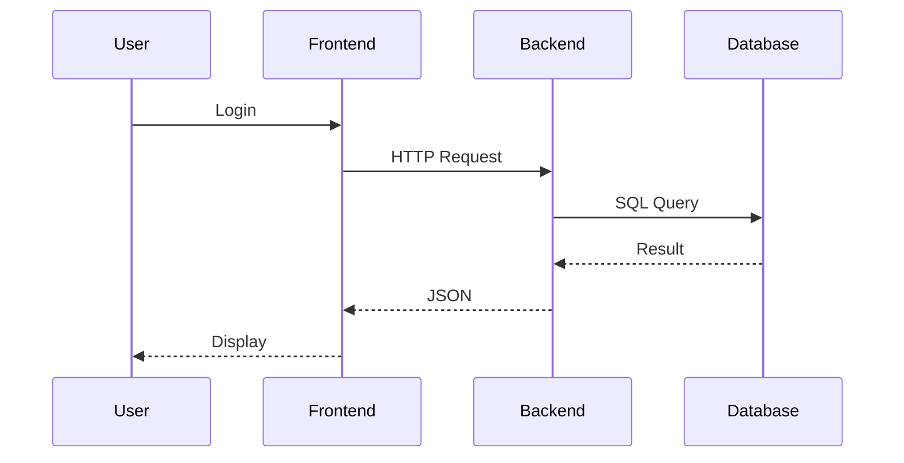
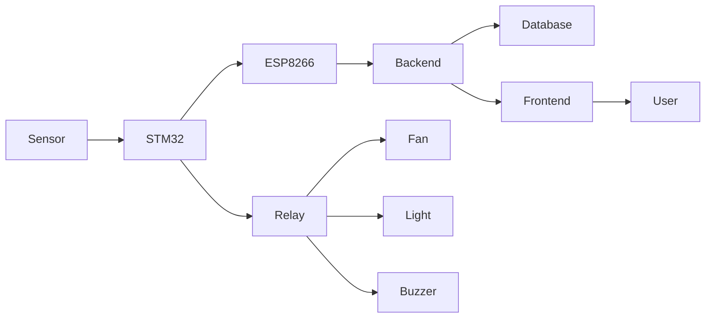
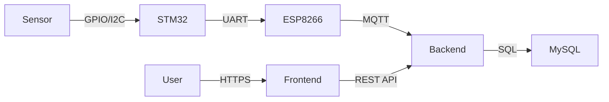

# Backend Architecture

## 1. Overview

## 2. Backend Architecture


## 3. MVC


## 4. Database Selection
Database
MySQL
Reason
- Open Source
- Stable
- Relational
- Suitable for IoT
- Easy Backup
- Good NodeJS Support

## 5. Database Schema


## 6. Data Storage Flow
```mermaid

flowchart LR

STM32

-->

ESP8266

-->

Backend

-->

Validation

-->

MySQL

-->

REST API

-->

Frontend

```

## 7. REST API Flow


## 8. Component Relationship


## 9. Communication Protocol
