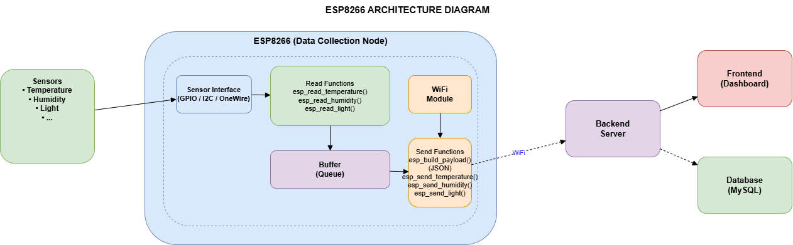
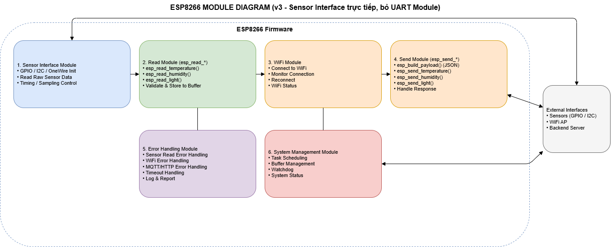
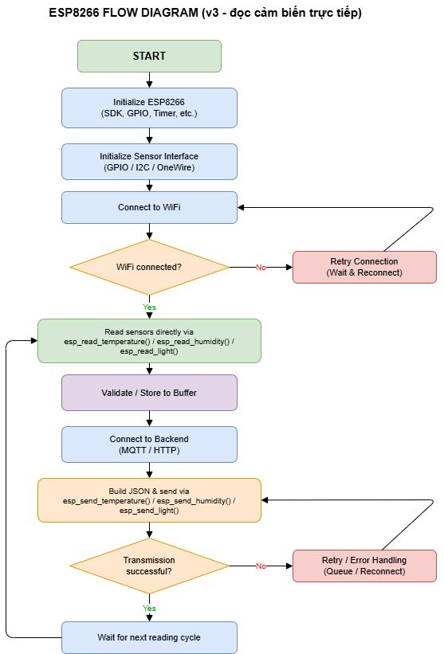

# ESP8266 Architecture

## 1. ESP8266 Architecture Diagram

The following diagram illustrates the software architecture of the ESP8266 Data Collection Node used in the IoT Laboratory Monitoring System.



---

## 2. Overview

The ESP8266 works as the **Data Collection Node** of the system.

It directly interfaces with environmental sensors through GPIO, I2C or OneWire, periodically reads sensor values, validates the collected data, stores it temporarily in an internal buffer, and transmits the information to the backend server through WiFi using MQTT or HTTP.

The ESP8266 is also responsible for maintaining WiFi connectivity, handling transmission failures, buffering unsent data, and monitoring overall system status.

---

## 3. Responsibilities

- Initialize GPIO, I2C and OneWire sensor interfaces.
- Periodically read sensor values.
- Validate sensor readings.
- Store collected data into a local buffer.
- Connect to WiFi Access Point.
- Build JSON payload.
- Send sensor data to the Backend using MQTT or HTTP.
- Retry transmission when communication fails.
- Handle WiFi reconnection automatically.
- Manage buffer, watchdog and system status.

---

## 4. Module Diagram



The ESP8266 software is divided into six functional modules.

### 4.1 Sensor Interface Module

**Responsibilities**

- GPIO initialization
- I2C initialization
- OneWire initialization
- Sensor sampling
- Timing control

---

### 4.2 Read Module

Responsible for acquiring sensor data.

**Functions**

```c
esp_read_temperature()
esp_read_humidity()
esp_read_light()
```

This module validates sensor readings before storing them into the internal buffer.

---

### 4.3 WiFi Module

**Responsibilities**

- Connect to WiFi
- Monitor WiFi connection
- Automatic reconnection
- WiFi status management

---

### 4.4 Send Module

Responsible for transmitting buffered data to the backend server.

**Functions**

```c
esp_build_payload()
esp_send_temperature()
esp_send_humidity()
esp_send_light()
```

The module converts sensor readings into JSON format before sending them through MQTT or HTTP.

---

### 4.5 Error Handling Module

**Responsibilities**

- Sensor read error handling
- WiFi error handling
- MQTT/HTTP communication error handling
- Timeout handling
- Logging and reporting
- Retry mechanism

---

### 4.6 System Management Module

**Responsibilities**

- Task scheduling
- Buffer management
- Watchdog monitoring
- System status management

---

## 5. Communication Flow



The ESP8266 executes the following workflow:

1. Initialize the ESP8266 SDK, GPIO, timers and required peripherals.
2. Initialize the sensor interfaces (GPIO, I2C or OneWire).
3. Connect to the configured WiFi network.
4. If WiFi connection fails, retry until the connection is successfully established.
5. Read sensor values using:
   - `esp_read_temperature()`
   - `esp_read_humidity()`
   - `esp_read_light()`
6. Validate the collected data.
7. Store valid data into the internal buffer.
8. Connect to the backend server using MQTT or HTTP.
9. Build a JSON payload using `esp_build_payload()`.
10. Send sensor data using:
    - `esp_send_temperature()`
    - `esp_send_humidity()`
    - `esp_send_light()`
11. If transmission fails:
    - Keep the data in the buffer.
    - Retry the transmission later.
12. If transmission succeeds:
    - Clear the transmitted data from the buffer.
    - Wait until the next sampling period.
13. Repeat the entire process continuously.

---

## 6. Software Architecture Summary

| Module | Main Responsibility |
|---------|---------------------|
| Sensor Interface | Initialize and communicate with GPIO/I2C/OneWire sensors |
| Read Module | Read, validate and buffer sensor data |
| WiFi Module | Manage WiFi connection and reconnection |
| Send Module | Build JSON payload and transmit data via MQTT/HTTP |
| Error Handling Module | Handle communication, sensor and timeout errors |
| System Management Module | Manage scheduling, watchdog, buffer and overall system status |
