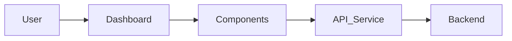
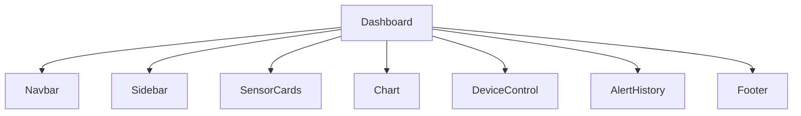
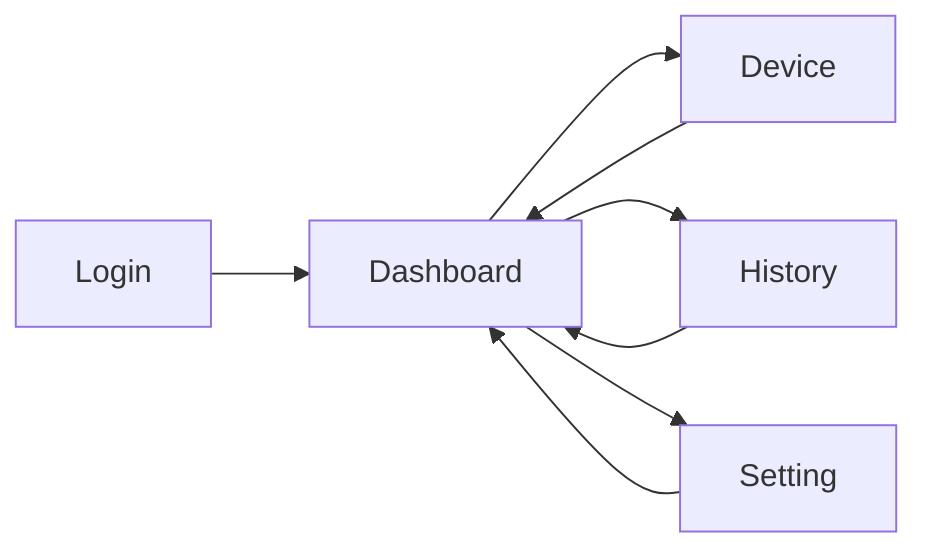
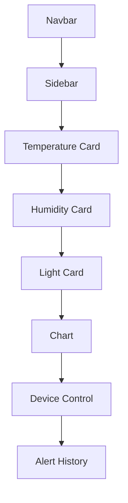

# Frontend Architecture

## 1. Overview
The Frontend Dashboard provides a web-based interface for monitoring environmental data collected from the IoT laboratory.
Users can monitor sensor values, control devices, receive alerts and configure threshold settings.

## 2. Frontend Architecture

## 3. Components

## 4. Window and Page Design
| Window | Description |
|---------|-------------|
| Login | User authentication |
| Dashboard | Monitoring sensor data |
| Device | Manual control |
| History | Alert history |
| Setting | Threshold configuration |

## 5. Navigation Flow

## 6. Sensor Data Visualization

