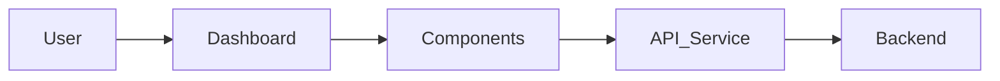
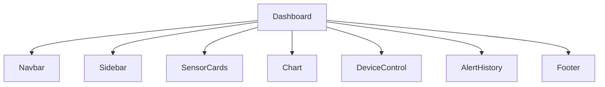
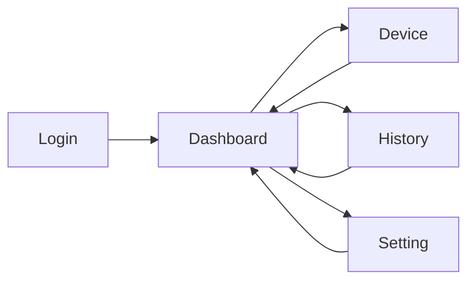
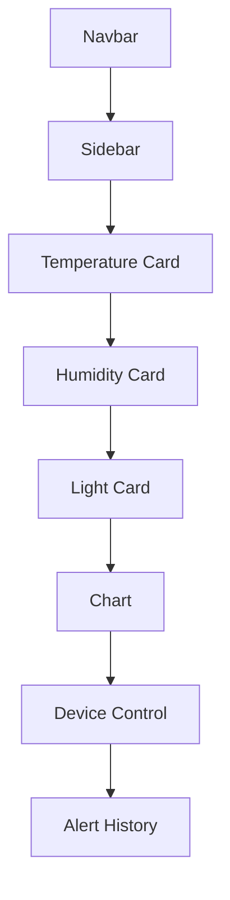

# Frontend Architecture

## 1. Overview
The Frontend is a web-based monitoring dashboard developed for the IoT Laboratory Monitoring System. It allows users to monitor environmental conditions within the laboratory through data collected from three IoT monitoring nodes deployed in different areas.

The dashboard provides real-time visualization of temperature, humidity, and light intensity measurements, as well as device status information and alert notifications. Users can also review historical data, monitor system health, and configure operational thresholds for automatic control functions.

By interacting with the backend through REST APIs, the frontend delivers a centralized and user-friendly platform for laboratory environment monitoring and management. The design supports future enhancements, including additional monitoring nodes, advanced analytics, and mobile accessibility.

## 2. Frontend Architecture

## 3. Components

## 4. Window and Page Design
| Window | Description |
|---------|-------------|
| Login | User authentication |
| Dashboard | Monitoring sensor data |
| Device | Manual control |
| History | Alert history |
| Setting | Threshold configuration |

## 5. Navigation Flow

## 6. Sensor Data Visualization

