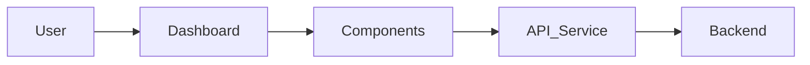
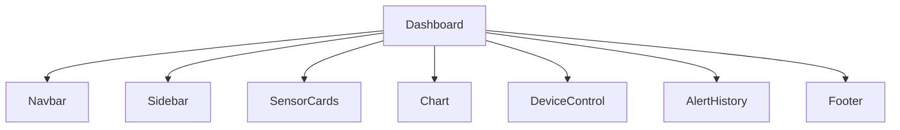
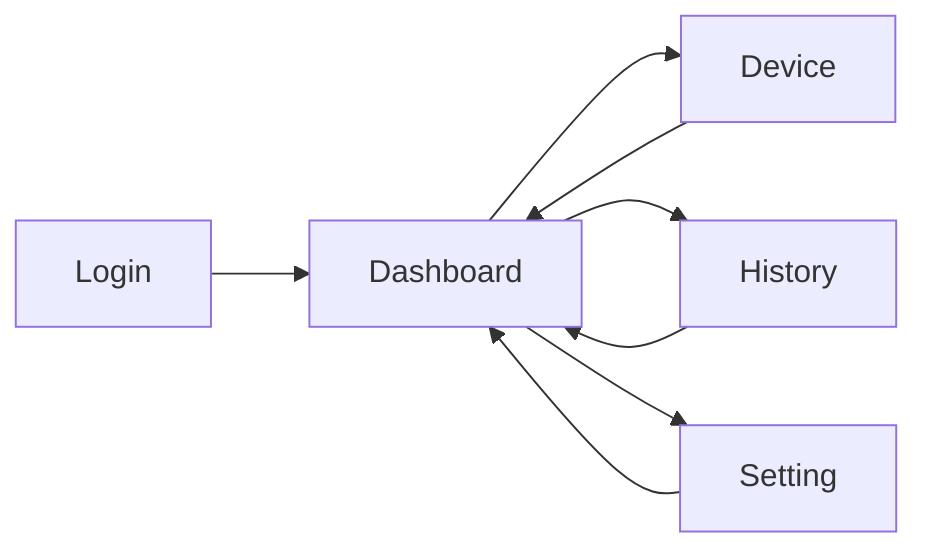
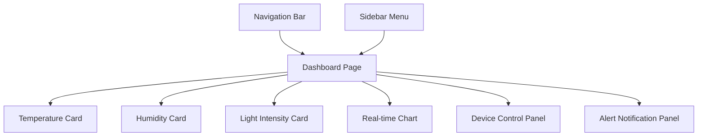
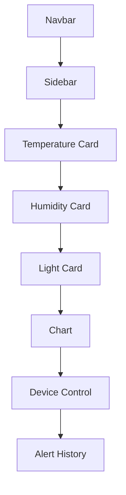

# Frontend Architecture

## 1. Overview
The Frontend is a web-based monitoring dashboard developed for the IoT Laboratory Monitoring System. The dashboard provides real-time visualization of temperature, humidity and light intensity data collected by ESP8266-based monitoring nodes deployed throughout the laboratory.

The dashboard provides real-time visualization of temperature, humidity, and light intensity measurements, as well as device status information and alert notifications. Users can also review historical data, monitor system health, and configure operational thresholds for automatic control functions.

By interacting with the backend through REST APIs, the frontend delivers a centralized and user-friendly platform for laboratory environment monitoring and management. The design supports future enhancements, including additional monitoring nodes, advanced analytics, and mobile accessibility.

## 2. Frontend Architecture

## 3. Components

## 4. Window and Page Design
| Window | Description |
|---------|-------------|
| Login | User authentication |
| Dashboard | Monitoring sensor data |
| Device | Manual control |
| History | Alert history |
| Setting | Threshold configuration |

## 5. Navigation Flow

## 6. Dashboard Wireframe

### Wireframe Description

The dashboard provides a centralized interface for monitoring laboratory conditions. Sensor cards display real-time environmental data, while charts visualize historical trends. Users can control connected devices and view system alerts from a single dashboard page.

## 7. Sensor Data Visualization

