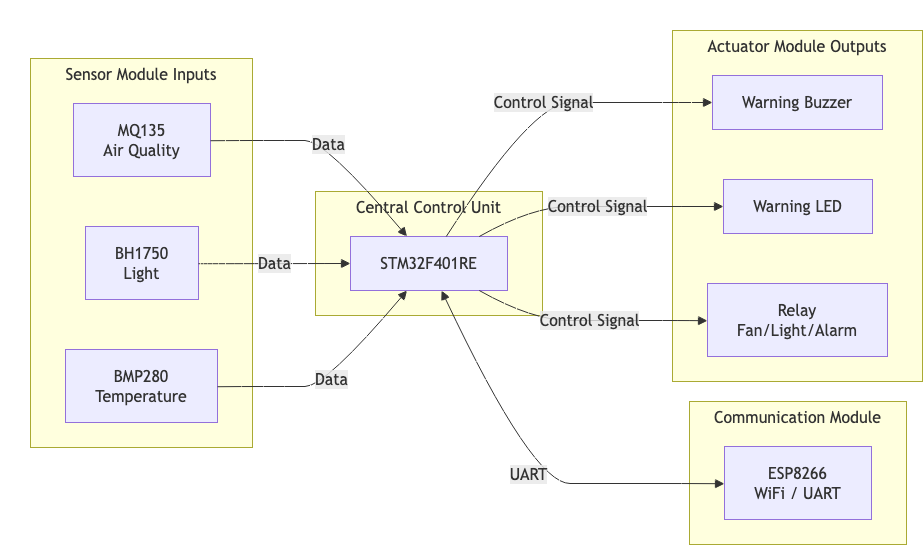
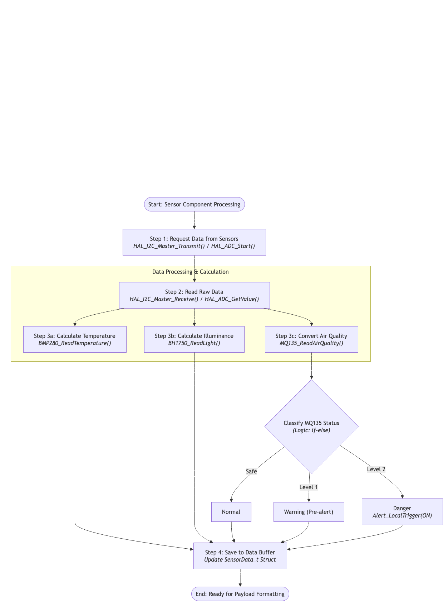
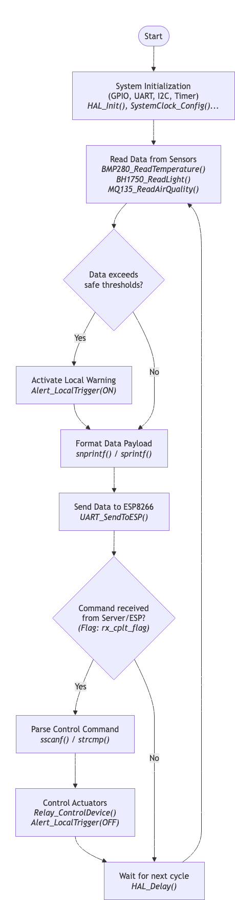

# STM32 Architecture

## 1. Overview
The STM32F401RE microcontroller serves as the central processing core at each IoT device (Node) in the laboratory environment monitoring and control system. The system deploys a total of 03 Nodes at strategic locations (room entrance, center of the room, and equipment area) to ensure coverage of the entire 60 m² space. The STM32 is responsible for interfacing with all hardware sensors, collecting environmental data in real-time, and managing actuators (Relays, LED, Buzzer) based on control commands from the centralized Server system.

## 2. STM32 Responsibilities
The main responsibilities of the STM32 at each Node include:
*   **Environmental Data Collection:** Interfacing with and continuously sampling data from temperature, light, and air quality sensors.
*   **Data Pre-processing:** Converting raw signals (ADC, voltage signals) into meaningful environmental indicators before transmission.
*   **Peripheral Communication (Uplink):** Packaging sensor data and transmitting it via UART protocol to the ESP8266 WiFi module to be sent to the Server.
*   **Command Reception and Control (Downlink):** Receiving control commands from the Server via the ESP8266, parsing the commands, and activating or deactivating the corresponding Relays.
*   **Local Alerting:** Automatically activating local alarm mechanisms (Buzzer, LED) upon receiving an alert signal from the system.

## 3. Hardware Components

The hardware architecture at each Node consists of the following components:

* **Central Microcontroller:** STM32F401RE.
* **Network Communication Module:** ESP8266 is responsible for the WiFi connection and transmitting data to the Server.
* **Local Alarm Mechanism:** LED and Buzzer.
* **Control Mechanism (via Relay):** Includes ventilation fans, lighting, and exhaust fans.

## 4. Software Architecture
The software architecture of the STM32 is built on the STM32CubeIDE development environment.
*   **Hardware Abstraction Layer (HAL):** The firmware utilizes STMicroelectronics' HAL library for direct control of low-level peripherals.
*   **Main Loop & Interrupts:** The sensor data reading operation is placed in the Main Loop with a predefined cycle. The function of receiving commands from the ESP8266 via UART is established using an interrupt (Rx Interrupt) to ensure no unexpected control commands from the Server are missed without blocking the main program execution.

## 5. Sensor Components
The STM32F401RE interfaces directly with a set of 3 sensors at each Node:
*   **BMP280:** Ambient temperature sensor.
*   **BH1750:** Illuminance (light intensity) sensor.
*   **MQ135:** Sensor for evaluating relative air pollution levels. (Note: The MQ135 is used to detect environmental fluctuations across Normal – Warning – Danger states; it does not directly measure exact CO2 concentration or AQI in ppm).

## 6. Sensor Data Processing
The sensor data processing occurs in the following steps:
1.  **I2C Communication:** Reading the registers of the BMP280 to obtain temperature values and the BH1750 for light intensity (Lux) values.
2.  **ADC Reading:** Converting the analog signal from the MQ135 into a digital value to determine the air pollution level.
3.  **Data Framing:** Aggregating raw data and assembling it into a string structure (JSON standard or comma-separated structure) to optimize payload size before transmission via UART.

## 7. Communication Interface
The system utilizes standard communication protocols to connect the hardware components:
*   **I2C (Inter-Integrated Circuit):** Communication between the STM32 and the digital sensors BMP280 and BH1750.
*   **ADC (Analog to Digital Converter):** Interface between the STM32 and the MQ135 gas sensor.
*   **UART (Universal Asynchronous Receiver-Transmitter):** High-speed bidirectional communication between the STM32 and the ESP8266 module (ESP-01). 
*   **GPIO (General-Purpose Input/Output):** Outputting control signals for the status of Relay modules, Buzzer, and LEDs.

## 8. Control Logic
The control logic is designed following a **Server-Centric** mechanism:
*   When environmental parameters exceed the regulatory thresholds (such as the ASHRAE standard for temperature or TCVN 7114-1:2008 for lighting), the Server will process calculations and issue control commands.
*   The ESP8266 receives these commands via the WiFi network and transmits them to the STM32 via UART.
*   The STM32 parses the command packet and outputs logic levels (High/Low) at the GPIO pins to open/close the control Relays for: Ventilation fans, Lighting, and Exhaust fans.
*   Simultaneously, local alarms are activated via GPIO pins connected to the Buzzer and Warning Light (LED).

## 9. STM32 Data Flow

The data flow starts from the physical environmental signals, passes through the sensor's converters, enters the STM32's peripherals, and is then transmitted via UART to the ESP8266 to go out to the internet network. When there is a control signal, the data flow goes in the opposite direction, from the UART into the STM32, and out through the GPIO pins to open/close the Relays.

## 10. STM32 Operation Sequence
The Infinite Loop operation sequence of the STM32 proceeds as follows:
1.  **System Initialization:** Power up and initialize the system (Clock, GPIO, I2C, UART, ADC). Wait for the MQ135 sensor to heat up and stabilize.
2.  **Data Acquisition:** Scan and collect measurement values from the BMP280, BH1750, and MQ135.
3.  **Data Transmission:** Package the data payload and push it through the UART port to the ESP8266.
4.  **Listen & Command Execution:** Check the UART receive interrupt flag to see if there is a new command sent down from the ESP8266.
    *   If **YES**: Update the status of the GPIO pins (Relays, Buzzer, LED) according to the corresponding command.
    *   If **NO**: Maintain the current status.
5.  **Delay/Sleep:** Wait for a predefined period before starting the next sampling cycle.
