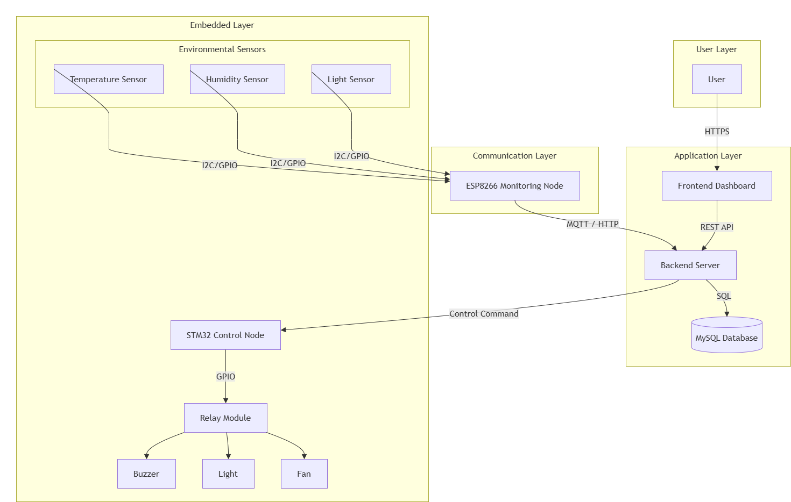

# System Architecture

## 1. Overview

The IoT Laboratory Monitoring and Control System is designed to provide real-time environmental monitoring and remote device control for laboratory environments. The system integrates embedded hardware, wireless communication, backend services, database storage, and a web-based dashboard into a unified architecture.

The architecture follows a layered design to improve modularity, maintainability, and scalability. Each layer has clearly defined responsibilities and communicates through standardized interfaces.

---

## 2. Architecture Layers

The system consists of four logical layers:

- User Layer
- Application Layer
- Communication Layer
- Embedded Layer

Each layer performs a specific function while remaining loosely coupled with the others.

---

## 3. Overall System Architecture

The following diagram illustrates the overall architecture of the IoT Laboratory Monitoring System.

### Layer Description

#### User Layer

Provides the interface for users to monitor environmental conditions and control laboratory devices through a web dashboard.

#### Application Layer

Processes user requests, stores sensor data, provides REST APIs, and manages business logic.

Components include:

- Frontend Dashboard
- Backend Server
- MySQL Database

#### Communication Layer

Acts as a gateway between the embedded devices and the application server.

Component:

- ESP8266 Gateway

Communication protocols:

- UART
- HTTP
- MQTT

#### Embedded Layer

Responsible for sensor acquisition and device control.

Components include:

- STM32 Controller
- Temperature Sensor
- Humidity Sensor
- Light Sensor
- Relay Module
- Fan
- Light
- Buzzer

---

## 4. Communication Protocol

The communication diagram below illustrates the communication interfaces between system components.

### Protocol Description

| Connection | Protocol | Purpose |
|------------|----------|---------|
| User ↔ Frontend | HTTPS | User interaction |
| Frontend ↔ Backend | REST API | Request and response |
| Backend ↔ Database | SQL | Data storage |
| Backend ↔ ESP8266 | HTTP / MQTT | Data transmission |
| ESP8266 ↔ STM32 | UART | Serial communication |
| STM32 ↔ Relay | GPIO | Device control |

---

## 5. Data Flow

The following diagram illustrates how sensor data and control commands flow through the system.

### Sensor Data Flow

1. STM32 acquires sensor data using the sensor interfaces (BMP280, BH1750, and MQ135).
2. STM32 packages the collected data into a communication payload.
3. ESP8266 receives the payload via UART and converts it into an MQTT/HTTP message.
4. The Backend Server receives the sensor data and stores it in the MySQL Database.
5. The Frontend Dashboard retrieves the latest sensor data through REST APIs.
6. Users monitor environmental conditions in real time via the web interface.

### Control Command Flow

1. User sends a control request.
2. Frontend forwards the request to Backend.
3. Backend sends the command to ESP8266.
4. ESP8266 forwards the command to STM32.
5. STM32 controls the Relay Module.
6. Relay switches laboratory devices on or off.

---

## 6. System Operation Sequence

The following sequence diagram illustrates the interaction between system components during monitoring and control operations.

### Main Operations

The primary software operations illustrated in the sequence diagram include:

- Sensor acquisition
- Payload construction
- UART communication
- MQTT/HTTP data publishing
- Database insertion
- REST API request handling
- Device control command processing
- Relay control
- Device status reporting

These operations represent the interaction between the STM32 Controller, ESP8266 Gateway, Backend Server, Database, and Frontend Dashboard during both monitoring and control processes.

The sequence begins with sensor data acquisition, followed by wireless data transmission to the backend server, database storage, dashboard visualization, user control requests, and finally hardware actuation through the STM32 controller.

---

## 7. Design Characteristics

The architecture provides the following advantages:

- Layered architecture for better modularity
- Loose coupling between hardware and software
- Easy maintenance and scalability
- Standard communication protocols
- Support for real-time monitoring
- Remote control capability
- Easy integration of additional sensors and actuators

---

## 8. Summary

The proposed architecture establishes a complete IoT monitoring and control platform by integrating embedded devices, wireless communication, backend services, databases, and web technologies. The layered design simplifies system maintenance and allows future extensions without significant architectural modifications.